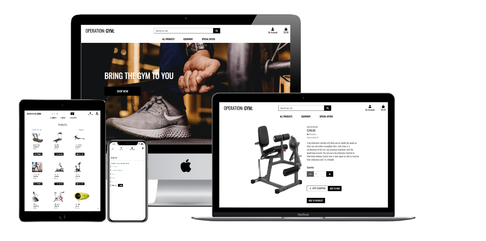

# Site Title
## Table of contents

<!--table start-->

- [UX](#UX)
- [Features](#Features)
    - [Existing Features](#Existing-Features)
    - [Features Left to Implement](#Features-Left-to-Implement) 
- [Technologies Used](#Technologies-Used)
    - [Languages](#Languages)
    - [Tools](#Tools)
    - [Frameworks](#Frameworks)
    - [Libraries](#Libraries)
- [Testing](#Testing)
- [Deployment](#Deployment)
    - [Online Deployment](#Online-deployment)
    - [Offline Deployment](#Offline/Local-Deployment)
- [Credits](#Credits)
    -[Content](#Content)
    -[Media](#Media)
    -[Acknowledgements](#Acknowledgements)
<!--table end-->


---
 
# UX

Due to my persistance in having long UX designs I have decided to compress it as a pdf [here](Readme_sourceFiles/UXdesign-final.pdf).
It contains all the written documentation for the User stories, Strategy Plane, Scope Plane, Structure Plane and skeleton Plane.
From here on forwards I will continue with the surface Plane.

Here are the wire frames I designed:
- [Landing page and prodict view](Readme_sourceFiles/Landing-page-and-products.pdf)
- [Wishlist and shopping page view](Readme_sourceFiles/Wishlist-and-bag-view.pdf)
- [Admin view](Readme_sourceFiles/admin-view.pdf)

I decided that for my colour scheme I want to stick to a black and white pallet. I want elements to look crispy and sharp.

The simpler the layout the better, as it drives intuition and creates a sense of comfort for the user to want to return to.

# Features
 
## Existing Features
- Registered shoppers have accounts to store their delivery information, see their order history, add products to their wish list and comment
- Regular shoppers are able to purchase products just like registered users but do not have the same benefits
- The site owner is able to add, edit and delete products from the store.
    - If a product is uploaded without an image then a default image is provided
- Each product has a name, SKU, category, description, stock and image.
- Due to the low traffic and high number of products at the current stage, having 2 users order the last product at the exact same time, is unlikely but I added some defensive programming for that:
    - By law the first person who buys the item, gets it. Thus only once a transaction is completed will the stock of the items be ckecked and be reduced by the quantity of that item.
    - if no stock is available then a user is unable to buy that product
- All users are able to search & filter search for any product in the store
- 

## Features Left to Implement

- I would like to make the mobile nav a bit more user friendly for mobile users but due to the number of icons and bootstrap, this will take a lot of time.
- I would like admins to be able to remove comments if they find them unfair without going into the `/admin` url.
- Better resolution Photographs

# Technologies Used

## Languages

- [HTML5](https://en.wikipedia.org/wiki/HTML5)
- [CSS3](https://en.wikipedia.org/wiki/Cascading_Style_Sheets#CSS_3)
- [JavaScript](https://en.wikipedia.org/wiki/JavaScript)
- [Pyhton3](https://www.python.org/downloads/release/python-380/)

### Tools

- [Autoprefixer](https://autoprefixer.github.io/)
- [Markup Validation service](https://validator.w3.org/)
- [Pep8 online check](http://pep8online.com/)
- [GitHub](https://github.com/)
- [Git](https://git-scm.com/)
- [Gitpod](https://chrome.google.com/webstore/detail/gitpod-online-ide/dodmmooeoklaejobgleioelladacbeki?hl=en)
- [VSC](https://code.visualstudio.com/download)
- [Microsoft Office](https://www.office.com/)
- [favicon](https://www.favicon.cc/)
- [AWS](https://aws.amazon.com/) - specifically S3
- [Stripe](https://stripe.com/)


### Frameworks

- [Bootstrap](https://getbootstrap.com/)
- [Font Awesome icons](https://fontawesome.com/icons?d=gallery)
- [Django](https://www.djangoproject.com/)

The following are dependancies imported from the cheese shop (They can be found in requirements.txt). 
- [asgiref==3.3.1](https://pypi.org/project/asgiref/)
- [boto3==1.17.12](https://pypi.org/project/boto3/)
- [botocore==1.20.12](https://pypi.org/project/botocore/)
- [9dj-database-url==0.5.00](https://pypi.org/project/dj-database-url/)
- [Django==3.1.5](https://pypi.org/project/Django/3.1.5/)
- [django-allauth==0.44.0](https://pypi.org/project/django-allauth/)
- [django-countries==7.0](https://pypi.org/project/django-countries/)
- [django-crispy-forms==1.11.0](https://pypi.org/project/django-crispy-forms/)
- [django-storages==1.11.1](https://pypi.org/project/django-storages/)
- [gunicorn==20.0.4](https://pypi.org/project/gunicorn/)
- [jmespath==0.10.0](https://pypi.org/project/jmespath/)
- [oauthlib==3.1.0](https://pypi.org/project/oauthlib/)
- [Pillow==8.1.0](https://pypi.org/project/Pillow/)
- [psycopg2-binary==2.8.6](https://pypi.org/project/psycopg2/)
- [PyJWT==2.0.1](https://pypi.org/project/PyJWT/)
- [python3-openid==3.2.0](https://pypi.org/project/python3-openid/)
- [pytz==2020.5](https://pypi.org/project/pytz/2020.5/)
- [requests-oauthlib==1.3.0](https://pypi.org/project/requests-oauthlib/)
- [s3transfer==0.3.4](https://pypi.org/project/s3transfer/)
- [sqlparse==0.4.1](https://pypi.org/project/sqlparse/)
- [stripe==2.55.1](https://pypi.org/project/stripe/2.55.1/)

### Libraries

- [JQuery](https://jquery.com)

# Testing

Due to this section being too long, I have written [a test file](testing.md).

# Deployment

Link to the live page: https://operation-gym.herokuapp.com/
## Online deployment

For this I used Gitpod to deploy my project.

- First create a [heroku](https://dashboard.heroku.com/apps) account and create a app - The name is up to you: mine was operation-gym. Select a region closest to you - mine was europe
- This assumes you already have a Stripe account. if not create one [here](https://stripe.com/)
- In heroku, under *resources tab* > *Add-ons*, search for postgress and add it. Select Hobby-Dev as your plan - should be free
    - Go to settings and ensure there is a variable called "DATABASE_URL"

- Product data needs to be imported
    - In the terminal type `python3 manage.py loaddata categories.json` followed by `python3 manage.py loaddata products.json`
    - Products depend on categories so order is important

- create a super user
    - In the terminal type `python3 manage.py createsuperuser`
    - follow the prompt in the terminal to create the superuser

- Create a Procfile for heroku
    - the context of the file should be `web: gunicorn [Main app].wsgi:application` - my main app is Gymshop

- In the terminal run `heroku login -i` and login to your heroku account through the terminal

- In *settings.py* > *ALLOWED_HOSTS* > add the heroku app url and local host:
    - `ALLOWED_HOSTS = ['[heroku app name].herokuapp.com', 'localhost']`

- Push code to Heroku - Note static files are not visible
    - initialize a heroku repository if not done so already 
        - Instructions for this can be found under the *Deploy* tab in heroku
    - Add and commit using git
    - Then `git push heroku master`

- set up automatic deploys in heroku
    - *Deploy* tab > *Deployment method* > Github > Search for the repository > Enable automatic deploys > master branch

- Set up a AWS account and initialise S3
    - Create a AWS account at [amazon web services](https://aws.amazon.com)
    - *My Account* > *AWS management console* >  Look for S3 - under recently visited service, the search bar or the *find services* search bar
    - *Create bucket* > Enter bucket name and region - name should be the same as heroku and region should be closest to you > Disable "Block public access"
    - Acknowledge the bucket is public > *Create bucket* > Click on the bucket's hyperlink > *Properties* tab
    - Scroll down to *Static Website Hosting* > *Edit* > *Static Website Hosting* - enable > *Hosting Type* - Host a static website > Fill out defualt values > *Save*
    - *Permissions* tab > *CORS* configuration > add the following code and save:
        ```
        [
            {
                "AllowedHeaders": [
                    "Authorization"
                ],
                "AllowedMethods": [
                    "GET"
                ],
                "AllowedOrigins": [
                    "*"
                ],
                "ExposeHeaders": []
            }
        ]
        ```
    - *Permissions* tab > *Bucket Policy* > Edit > *Policy Generator* > a new tab will open
        - Policy Type: S3
        - Effect: Allow
        - Principal: *
        - Actions : GetObject
        - ARN: paste from previous tab
    - *Add Statement* > *Generate Policy* > Copy the Policy > go back to the previous tab and paste it in
        - add `/*` at the end of the resource key > *Save*
    - *Permissions* tab > *ACL* > *Public access* > Tick "List" under the objects column
    - In the top Nav under *Services* > *IAM* > *Groups* > *Create new group* > name : *manage-operation-gym* > *Next step* > *Next step* > *Create group*
    - In the side Nav click *Policies* > *Create Policy* > *JSON* tab > *Import managed Policy* > search for: "AmazonS3FullAccess" > *import*
    - Create a list ([]) at the resource value and paste the ARN twice and append `/*` to the end of the second ARN (both are strings so "" is needed and need to be comma seperated)
        - `["ARN", "ARN/*"]`
    - *Next: tags* > *Next: Review* > provide name and description > *Create Policy*
    - Side Nav, click on *Groups* > *manage-operation-gym* > *Permissions* tab > *Attach Policy* > search and select the policy that was created > Attach Policy
    - Side Nav, click on *Users* > *Add User* > enter a name for the user > Access type: Programmatic access > *Next: permissions* > Add user to Group > *Next* until the end > *create user*
    - Download the CSV file from the success page > click *Close*

- Connect django to S3
    - In *settings.py* > change the following code:
    ```
        AWS_STORAGE_BUCKET_NAME = '[your bucket name]'
        AWS_S3_REGION_NAME = '[your region]'

    ```
    - Go to heroku > *Settings* > *Config Vars* > Add the following config vars:
        - `AWS_ACCESS_KEY_ID` - (value found in the CSV file)
        - `AWS_SECRET_ACCESS_KEY` - (value found in the CSV file)
    - Rebuild the app and see the files appearing the S3 bucket
    - Go to the S3 bucket > *Create folder* > name it media > upload the content of the media file > Set ACL public access to "read" in the objects column

- Create email functionality
    - In Gmail (due to it's simplicity) got to *Settings* > *See all settings* > *Accounts and import* > *Other google account settings*
    - A new tab will open. In the side nav, click *Security* > turn on *2 step verification* > *App Passwords* 
    - "Select the app and device you want to generate the app password for" : *Other*
    - Add a custom name > *Generate*
    - A window will appear with a key. Do not close this window. Copy the key to your clipboard
    - In the config vars of the heroku app create 2 variables:
        - `EMAIL_HOST_PASS`: The key generated by gmail
        - `EMAIL_HOST_USER`: your email address where the key was retrieved from 

- In Heroku Config vars add your variables:
    - DATABASE_URL - Should already by provided by Postgress
    - DEVELOPMENT - Boolean - False
    - SECRET_KEY - Provided by Django
    - STRIPE_PUBLIC_KEY - Provided by Stripe - "Publishable key" on Stripe dashboard
    - STRIPE_SECRET_KEY - Provided by Stripe - "Secret key" on Stripe dashboard 
    - STRIPE_WH_SECRET - Provided by Stripe - *Developers* > *Webhooks* > add an end point > select endpoint > *Signing secret*
        - log in to stripe *Stripe* > Side Nav, click *Developers* > *Webhooks* > add endpoint >  the endpoint is `[URL of deployed site]/checkout/wh/` > *recieve all events* > *add endpoint*
        - Send a test webhook if this is successful. Sometimes it is slow to proccess this and a 401 error will appear but if you wait a few minutes it should work

- Login to the deployed site's admnin (`/admin`) with admin login details and then verify the admin account

- Site is now fully Deployed and is 100% functional

## Offline/Local Deployment

1. In VSC , First clone the project from Github

        git clone https://github.com/KeisGSmit/Gymshop.git

2. Create a virtual environment in Windows. Navigate to where the project folder is and run:

            python -m venv venv

3. Activate the venv - Navigate to venv folder in the terminal window and inside run:

            C:\Python\Django_Project_Name\venv>Scripts\activate
    
- If activation was successful, you should see the name of the virtual environment in curly braces in the front of the path:
   
            (venv) C:\Python\Django_Project_Name\venv>

4. Install packages needed for the project:

            (venv) C:\Python\Django_Project_Name> pip install requirements.txt

5. Create your superuser(admin)

            python manage.py createsuper

6. Run command:

            python manage.py makemigrations

7. Run command:

            python manage.py migrate

8. Create an env.py to store the env variables. The env variables needed for the project are: DATABASE_URL, SECRET_KEY, STRIPE_PUBLIC_KEY, STRIPE_SECRET_KEY, AWS_ACCESS_KEY_ID, AWS_SECRET_ACCESS_KEY, EMAIL_HOST_USER, EMAIL_HOST_PASS
        
9. You will need your own S3 bucket for storing media.
        
10. To generate a random key for SECRET_KEY, in CMD:

            >>>import secrets
            >>>secrets.token_hex(16)
            >>>'15412c9e3e3ff5e03cac2270cc6fb57f'
            >>>exit()


# Credits

## Content
- [Gym Equipment JSON content](https://www.fitandme.com/guide-gym-equipment-names-how-to-use/#tab-con-18)
- [simplifaster](https://simplifaster.com/articles/curved-treadmills-pros-cons/)
- [Flat treadmill](https://www.amazon.com/TOE-Treadmill-Installation-Absorption-Apartment/dp/B08LQPPL5X/ref=sr_1_3?dchild=1&keywords=Small+Treadmill+for+Apartment&qid=1611918688&sr=8-3)

## Media

- [Unsplash](https://unsplash.com/)
- [kaggle](https://www.kaggle.com/dutt2302/gym-equipment?select=gym_data)
- [Json Media](https://www.fitandme.com/guide-gym-equipment-names-how-to-use/#tab-con-18)
- [majority of the product images](https://www.fitandme.com/guide-gym-equipment-names-how-to-use/#tab-con-14)

## Acknowledgements
- landing page inspired by [Uber](https://www.uber.com/za/en/s/r/?ad_id=480478681398&adg_id=116208467707&campaign_id=11623286126&cre=480478681398&dev=c&dev_m=&fi_id=&gclid=Cj0KCQiAj9iBBhCJARIsAE9qRtBXUQF4YSrnZO-tca0LJJa6-Cy0geBgyKTriXhnVYtnRS4wohH8ch4aAgl1EALw_wcB&gclsrc=aw.ds&kw=uber&kwid=kwd-169801042&match=e&net=g&placement=&tar=&utm_campaign=CM2062787-search-google-brand_161_-99_ZA-National_rider_web_acq_cpc_en_Brand_exact_uber_kwd-169801042_480478681398_116208467707_e_c&utm_source=AdWords_Brand)
- I got the inspiration to make this project as I used some of the styling and functionality applied on it from code institute "Project - [Boutique Ado](https://github.com/KeisGSmit/OnlineShop)"
- The business Logic was inspired by [Gymshark](https://eu.gymshark.com/)
- The tutors at conde institute - [Igor](https://github.com/bravoalpha79), [Miklos](https://github.com/Sarosim), Johann Alberts, Stephen, Kevin, [Tim](https://github.com/TravelTimN)
- [DickV](https://github.com/dickvla)(mentor)
