Initially this would have been the first project I wanted to use Unit tests to do my testing for me.
Unfortunately my coding abilities for production are better than my coding abilities for testing.

I had to fall back on my old-school technique of manual testing everything. 

---  
# Content
- [Functionality testing](#Functionality-Testing)
    - [Login / Registration](#Login/Registration)
    - [Adding product to the bag](#Adding-product-to-the-bag)
    - [Modifying the bag](#Modifying-the-bag)
    - [Adding product to wish list](#Adding-product-to-wish-list)
    - [Modifying Wish list](#Modifying-Wish-list)
    - [Commenting on products](#Commenting-on-products)
    - [Deleting comments](#Deleting-comments)
    - [Checkout](#Checkout)
    - [Profile](#Profile)
    - [Product Admin](#Product-Admin)
    - [Browsing products](#Browsing-products)
    - [Search functionality](#Search-functionality)
    - [Logout](#Logout)

--- 
# Functionality Testing 
---
## Login/Registration
### Registration
- A new user opens the site
- Clicking on "My Account" > Register - takes the user to the registration form

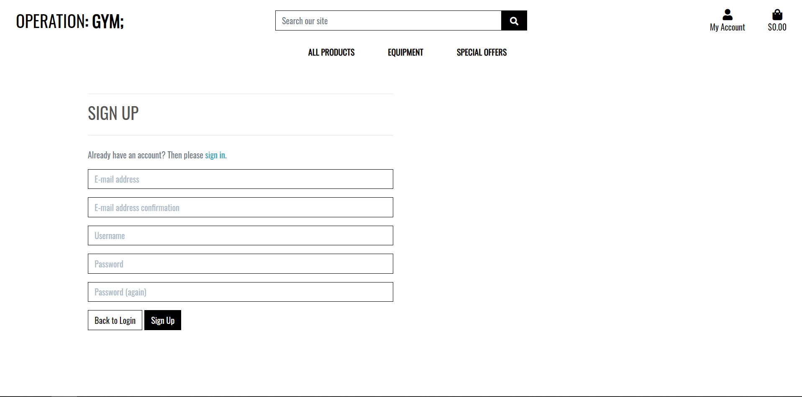

- Filling out the form and submitting it sends a email to the user
- Clicking on the link in the email takes the user to the sign in page where they sign in

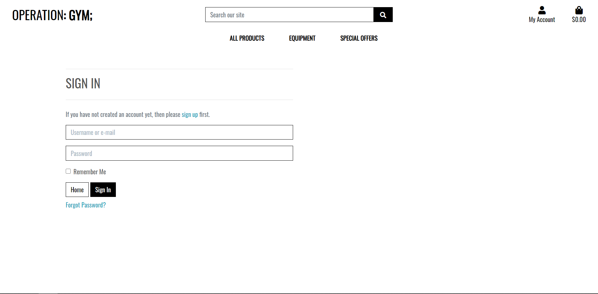

- Sign in is successful with the registered details

#### Forcing URLS
- Forcing URLs does not work since a unique key is attached to the link sent to the user
- Forcing Other URLs will only generate the registration page, the login page and the home page

### Login
- A user who has registered and is logged out opens the site
- Clicking on "My Account" > Sign in - takes user to a sign in page
- Filling out the form successfully sends user to the home page and they are signed in
- Unsuccessful submissions result in errors being displayed
    - Users are able to change their password if needed

## Adding product to the bag
- A new site user or a registered user is using the site
- A user uses the main navigation or search functionality to find a product
- Opening a product details page and clicking on add to bag adds a product to the cookie created
    - The user is able to select the amount of that item (quantity)
    - The user is unable to add more than what is in stock

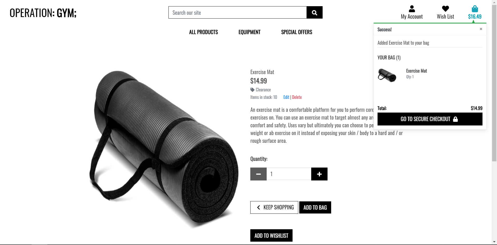

- Clicking on the bag icon then takes the user to the page where they can view their bag and make modifications

### Forcing URLs
- Forcing a URL like `bag/add/2` creates a TypeError without submitting a form
- To prevent such things from happening: This code has been implemented in bag/views.py to handle `GET` requests to URLs which users are not supposed to visit
```
    else:
        messages.error(request, "No such URL exists")
        return render(request, 'home/index.html')
```

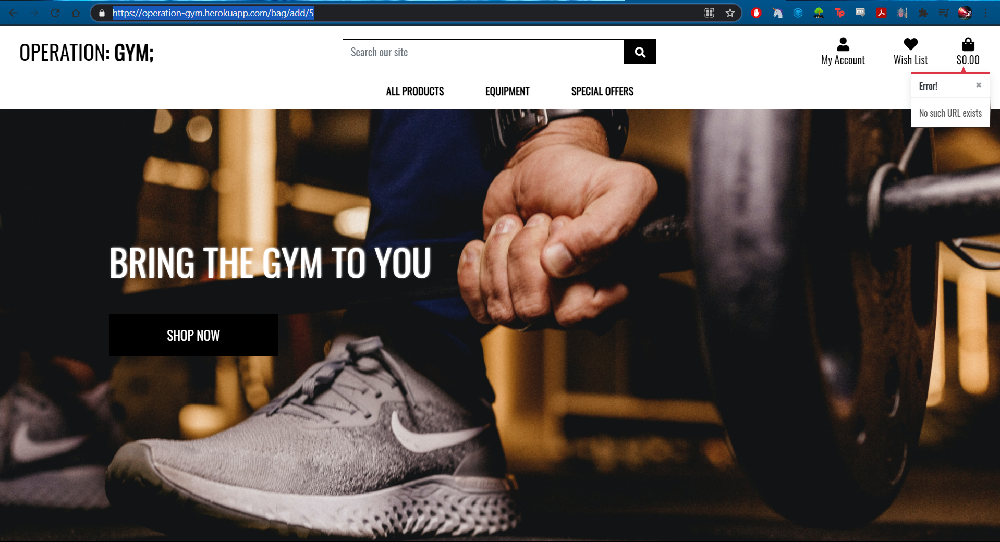

## Modifying the bag
- A user (new/old) has items in their bag and is at the page where they view their bag

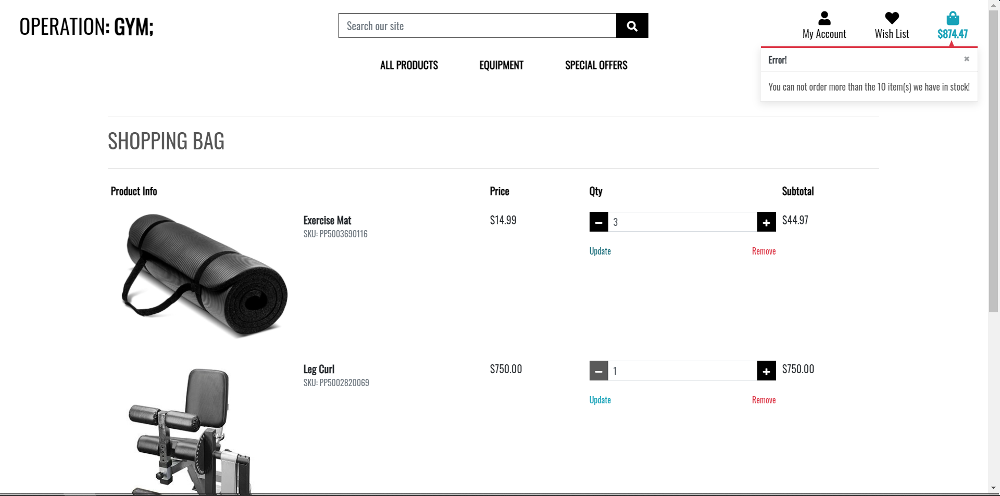

- Items are displayed in a table
- Modifications occur under the *Qty* table heading
- Changing the quantity and clicking on "Update" will update the quantity (can't go higher than 99 and lower than 0 - via the buttons)
    - If a user wants to add more stock (quantity) than what the store has in stock a error message will appear
- Clicking on "Delete" will remove a item from the bag
- Setting the quantity to 0 or lower (manually) and clicking update will remove that item from the bag
- If all items have been removed then text saying "Your bag is empty" will appear

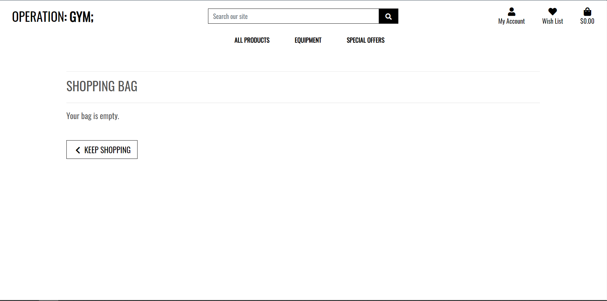

### Forcing URLs
- After the modifications in [Adding product to the bag](#Adding-product-to-the-bag) users are unable to force URLs

## Adding product to wish list
- To access this feature a user must be logged in. Forcing URLS (not logged in) will result in a Sign in page appearing
- A signed in user can add a product to their wish list by clicking "Add to wishlist" - a success message will appear saying that the item has been added to their wish list
- The Add to Wishlist button is available on the products page or the product's details page. 
- A user is unable to add produts through forcing URLs and will be redirected to the home page with a error message

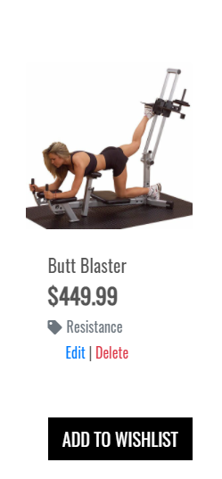

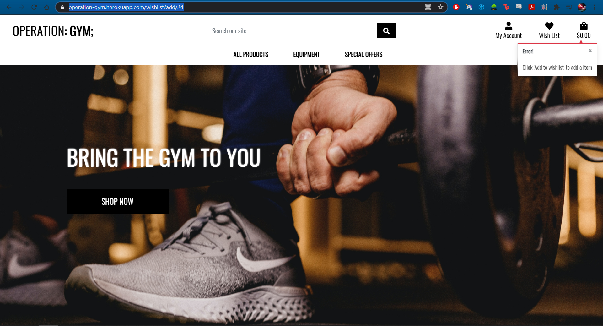

## Modifying Wish list
- To access this feature a user must be logged in. Forcing URLS (not logged in) will result in a Sign in page appearing.
- If a user is signed in and is forcing urls like `/wishlist/add/7` or `/wishlist/delete/2` results in a redirect to the homepage with a error message, as in the above image
- Going to the wish list with no items in the wish list displays text saying 'Your wish list is empty'
- Going to the wish list (with items in wish list) will display each item in a table
- On the far right there is a button "Remove from Wish list"
- Clicking that button removes the item from the user's wish list

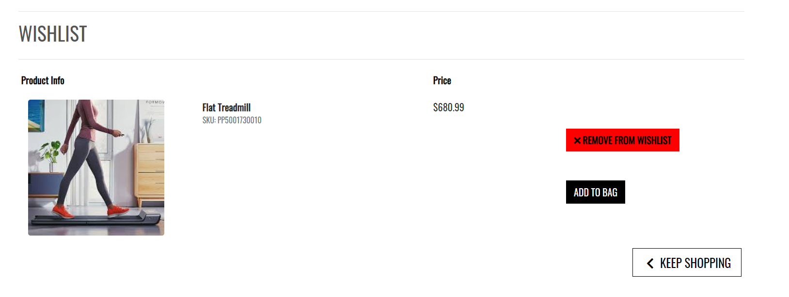

### Purchasing items from the wish list
- If a user goes to their wish list and has a item in their wish list on the far right there is a button called "Add to bag"
- Clicking that button will take a user to that product's product details page where the user can add it to their bag
- Upon purchasing the item, it will remain inside the wish list

## Commenting on products
- Users need to be logged in to use this feature
- Forcing urls like `comment/add/7` results in a redirect and an error message
- A user will have to go to the product's details page to post a comment
- Commenting more than once is not possible - users must delete their old comment and re-comment
    - This is to prevent spam
-  Only the user who posted the comment can delete it
- Upon successful commenting, the page redirects user to the same product's details page and their comment is on display 

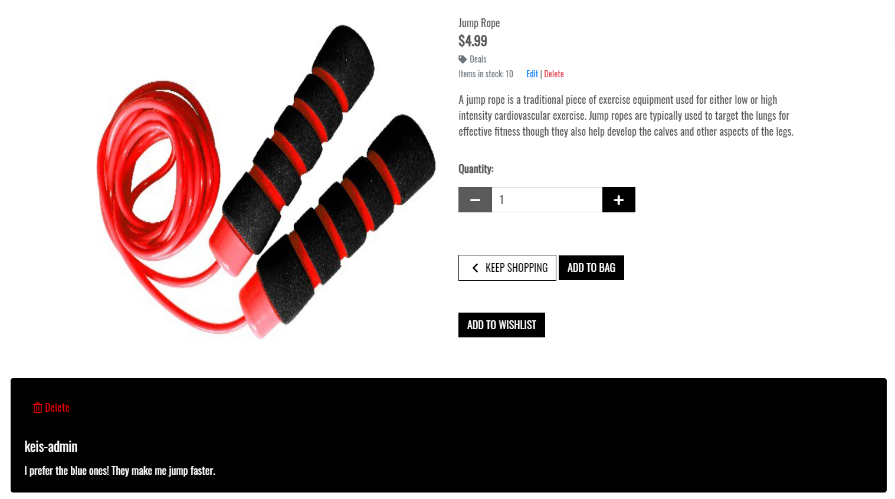

## Deleting comments
- As stated above:
    - Users need to be logged in to use this feature
    - Forcing urls like `comment/delete/7` results in a redirect and a error message
    - Only the user who posted the comment can delete it
- Each comment posted by a user has a red button at the top of its card with trash icon.
- Clicking on it will redirect a user to the product's details page and their comment won't be present

## Checkout, Stripe and webhooks
- As a anonymous user
    - A user adds products to their bag.
    - The user clicks on their bag or "Go to secure checkout"
    - They are at their bag view > clicking on secure checkout should take the user to the form where they submit their delivery and card details 
        - No items in the bag results in them being unable to click the checkout button
    - Filling out the checkout form (successfully) and clicking "Complete order" takes a user to the "Checkout success" page where their receipt is displayed to them
        - Anonymous users are unable to save their delivery information
    - Looking at stripe - The order has been placed
    - Looking in the order form in the admin shows the order has been placed

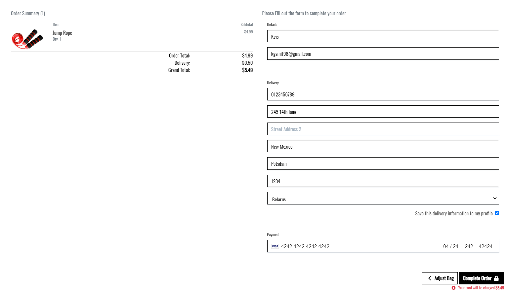

- As a registered user
    - A user adds products to their bag.
    - The user clicks on their bag or "Go to secure checkout"
    - They are at their bag view > clicking on secure checkout should take the user to the form where they submit their delivery and card details 
        - No items in the bag results in them being unable to click the checkout button
    - Filling out the checkout form (successfully) and clicking "Complete order" takes a user to the "Checkout success" page where their receipt is displayed to them
        - If the user clicked on "Save this delivery information to my profile" at previous checkout then the form auto completes the delivery information for them
    - Looking at stripe - The order has been placed
    - Looking in the order form in the admin shows the order has been placed

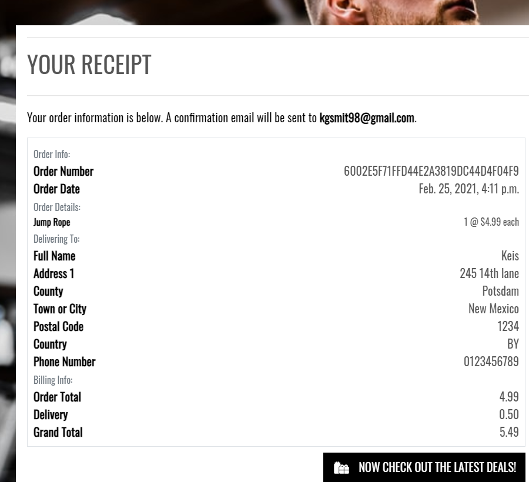

### Failing checkouts
- Once the checkout form has been submitted, the window is closed, to simulate a failure
- Looking at stripe and the order admin the orders have been placed and stripe successfully processed the payment

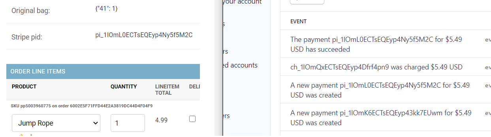

### Checkout Conflict
- If two users order the last item at the exact same time nothing will happen
- The user who checks out first (successfully) will modify the stock 
- When the second wants to checkout their stock is checked
- If the remaining stock is less than 0 then an error will appear telling them which item has run out of stock
- The second user will not be able to checkout until they modify their bag
- After the modifications the second user is able to checkout

## Profile
- Users need to be logged in to use this feature
- Being logged out and using this feature results in a redirect to the sign in page
- Once the user accesses the profile page they can update their delivery information and see their order history
- Updating the delivery information and attempting to purchase a item will result in the updated delivery information being auto-completed
- Clicking on the delivery history displays the order's receipt page

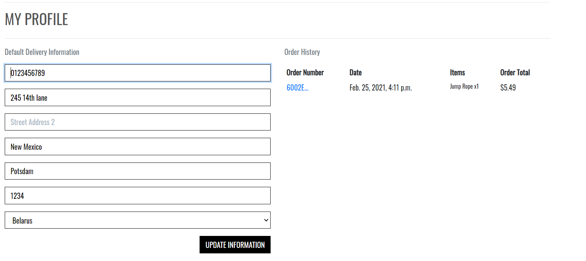

## Product Admin
- Users need to be logged in as a superuser/admin to use this feature
- Forcing the right URLS result in the user being redirected to the sign in page (anonymous user) or redirect to the home page with a error message (regular user)
- Clicking on "Product Management" allows the admin to add a product - filling out the form creates a new product
    - The price and stock cannot be negative
    - The price cannot have more than 6 figures
    - The user will be redirected to that product's details page
- On the products page or product's details page the admin can edit or delete products
    - Editing a product results in the same form, as adding a product, being displayed but the product's details are auto-filled in
    - Clicking on Delete removes the product from the database

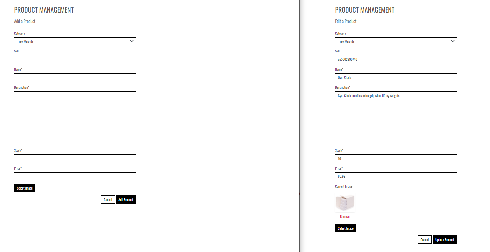

## Browsing products
- Any user can browse products
- A user can use the Nav bar to filter through products - clearance, resistance machines etc.
- On the products page a user can filter results in ascending or descending order of: Price, Name and Category 

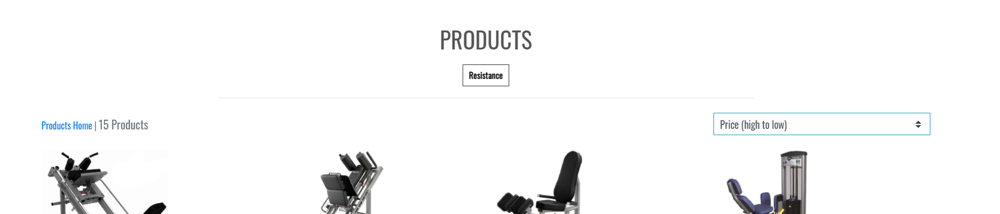

## Search functionality
- In the top Nav bar is a search bar (any user can use it)
- If a user enters a word in the search bar, the products name or description will be searched for that word
- If a relevant word is not found, no products will be displayed and a search result will be displayed
- If a relevant word is found, products will be displayed along with the number of search results


## Logout
- Only a user that is logged in can use this
- Under "My Account" > Logout
- This takes users to a sign out page where they can click "Cancel" or "Sign Out"
- Clicking cancel redirects the user to the home page and they are still logged in
- Clicking sign out redirects the user to the homepage and they are logged out.


